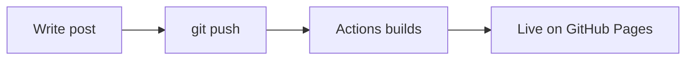

This post documents the full history of changes to this blog. Partly for my own reference, partly because I think the process of setting up a dev blog is underrated as a learning exercise.

---

## Initial Setup — Feb 2026

Started with [Hugo](https://gohugo.io/) + the [PaperMod](https://github.com/adityatelange/hugo-PaperMod) theme. The decision was straightforward:

- **Hugo** is compiled Go, so builds are near-instant even with lots of posts
- **PaperMod** has clean typography, dark mode, math support, and search out of the box
- **GitHub Pages** + **GitHub Actions** = free hosting with automatic deploys on every push

The deploy pipeline in `.github/workflows/deploy.yml` is about 20 lines:

```yaml
- uses: actions/checkout@v4
  with:
    submodules: true      # PaperMod is a git submodule
    fetch-depth: 0        # needed for .GitInfo in posts
- name: Setup Hugo
  uses: peaceiris/actions-hugo@v3
  with:
    hugo-version: "latest"
    extended: true        # required for SCSS
- run: hugo --minify
```

Push to `main` → Actions builds → deploys to GitHub Pages. Zero manual steps after the initial setup.

### KaTeX for Math

PaperMod doesn't ship KaTeX by default — it expects you to bring your own. Added it via `layouts/partials/extend_head.html`:

```html
{{ if or .Params.math .Site.Params.math }}
<script defer src="katex.min.js"></script>
<script defer src="auto-render.min.js"
    onload="renderMathInElement(document.body, { delimiters: [...] })">
</script>
{{ end }}
```

Set `math: true` in any post's front matter and you get inline `$...$` and display `$$...$$` rendering.

### Mermaid Diagrams

Similarly wired up via `layouts/_default/_markup/render-codeblock-mermaid.html`, so fenced code blocks tagged `mermaid` render as diagrams:



---

## About Page — May 2026

Built a custom About page with raw HTML inside Markdown. Hugo's Goldmark renderer has `unsafe: true` to allow this. The page has:

- Circular avatar from Aliyun OSS
- Name + headline + location
- Social buttons (GitHub, email)
- Tech stack tags
- Project cards

**Bugs found and fixed:**

| Bug | Fix |
|-----|-----|
| `title: ""` — empty page title, invisible to search engines | Changed to `"About"` |
| Contact button had `mailto:your-email@example.com` placeholder | Fixed to real email |
| All three project cards linked to `href="#"` | Linked to actual URLs |
| Duplicate CSS rule for `.about-avatar-wrap` | Removed duplicate |

---

## Language Switcher Evolution

### Round 1: Hugo Multilingual — Removed

The blog was initially set up with Hugo's built-in multilingual mode (`languages: en / zh` in `hugo.yaml`). This adds a "Zh" button to the navbar that switches between `/` (English) and `/zh/` (Chinese) URL trees.

Problem: I only write in English. Clicking "Zh" landed on an empty Chinese site. Removed the `languages` block entirely and moved all config to top-level.

### Round 2: Google Translate Button — Added

Added a custom "Zh / EN" toggle button in the navbar that uses the Google Translate JavaScript API to translate the page in-place — no page reload, no URL change.

Implementation in `extend_head.html`:

```javascript
// Hidden GT widget (required to initialize the API)
new google.translate.TranslateElement({
    pageLanguage: 'en',
    includedLanguages: 'zh-CN',
    autoDisplay: false
}, 'google_translate_element');

// Programmatic trigger
function applyLang(lang) {
    var combo = document.querySelector('.goog-te-combo');
    combo.value = lang;
    combo.dispatchEvent(new Event('change'));
}
```

The button is injected via JS next to PaperMod's theme toggle (`#theme-toggle`), so it fits naturally into the existing nav without modifying any theme templates.

### Round 3: Protect Math + UI

Two additional protections applied before translation runs:

**1. Math formulas** — KaTeX renders into `.katex` spans. Google Translate would mangle the LaTeX notation. Fixed by adding `translate="no"` to every `.katex` element before triggering translation.

**2. UI chrome** — Only the article body should be translated. The navbar, footer, post metadata, tags, and ToC get `translate="no"` so they stay in English regardless of the translate state.

```javascript
function protectUI() {
    ['header.header', 'footer.footer', '.post-meta',
     '.post-tags', '#TableOfContents', '.breadcrumbs', ...]
    .forEach(sel => document.querySelectorAll(sel).forEach(el => {
        el.setAttribute('translate', 'no');
    }));
}
```

The Google Translate banner that normally appears at the top of the page is suppressed via CSS:

```css
.goog-te-banner-frame { display: none !important; }
body { top: 0 !important; }
```

---

## Posts Added

| Date | Post | Topics |
|------|------|--------|
| Apr 20, 2026 | How Transformers Work | Self-attention, multi-head attention, positional encoding, encoder-decoder |
| May 1, 2026 | LLM Agents: ReAct, Tool Use, Planning | ReAct loop, CoT math, tool calling, ToT, Reflexion, RAG |
| May 6, 2026 | This devlog | Hugo setup, PaperMod, CI/CD, translate feature |

---

## Things Still on the List

- [ ] Pin `hugo-version` to a specific release instead of `"latest"`
- [ ] Add Open Graph image for better link previews
- [ ] Write more posts (this blog's biggest problem is empty `content/posts/`)
- [ ] Add Goodle and Sudoku project links once those repos are public
