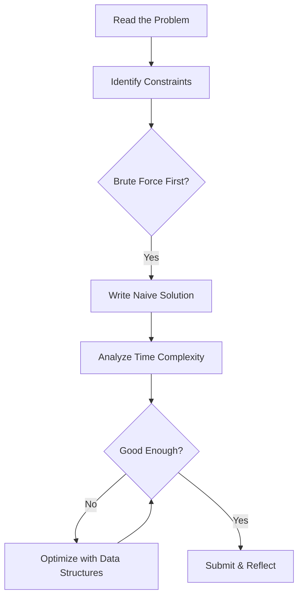

<!--
 * @Author: Maggie xungirl1024@gmail.com
 * @Date: 2026-02-10 01:57:02
 * @LastEditors: Maggie xungirl1024@gmail.com
 * @LastEditTime: 2026-02-10 01:59:14
 * @FilePath: /undefined/Users/xunxun/myblog/content/posts/my-first-post.md
 * @Description: 这是默认设置,请设置`customMade`, 打开koroFileHeader查看配置 进行设置: https://github.com/OBKoro1/koro1FileHeader/wiki/%E9%85%8D%E7%BD%AE
-->
---
title: "My First Post"
date: 2026-02-10
draft: false
tags: ["intro", "blog"]
math: true
mermaid: true
ShowToc: true
---

## Welcome

Hi, I'm Jiaju — a CS student at Northeastern University. This blog is where I share what I learn about programming, algorithms, and software engineering.

## Why I Started This Blog

Writing helps me think more clearly. By explaining concepts in my own words, I understand them better. Plus, it's a great way to track my learning journey.

## A Quick Math Demo

The time complexity of merge sort can be expressed as:

$$T(n) = 2T\left(\frac{n}{2}\right) + O(n)$$

Which gives us $O(n \log n)$ — much better than bubble sort's $O(n^2)$.

## How I Think About Problem Solving


## A Simple Two Sum in Java

One of the classic interview problems:
```java
public int[] twoSum(int[] nums, int target) {
    Map<Integer, Integer> map = new HashMap<>();
    for (int i = 0; i < nums.length; i++) {
        int complement = target - nums[i];
        if (map.containsKey(complement)) {
            return new int[] { map.get(complement), i };
        }
        map.put(nums[i], i);
    }
    return new int[] {};
}
```

This runs in $O(n)$ time using a hash map, compared to the brute force $O(n^2)$ approach.

## What's Next

I plan to write about:

- Object-oriented design patterns
- Algorithm breakdowns (sliding window, DFS, etc.)
- Full-stack development with React and FastAPI
- Lessons learned from team projects

Stay tuned!