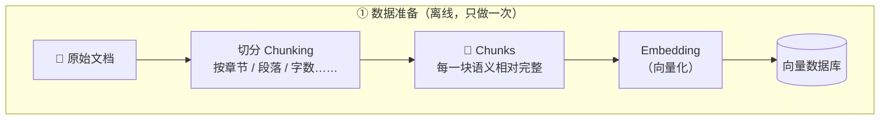
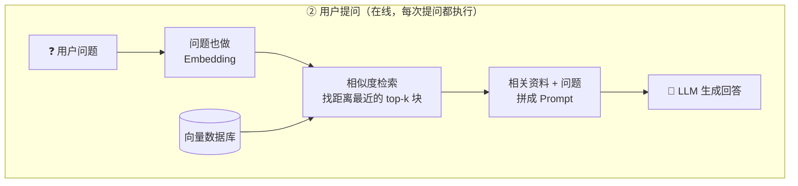

这篇是我学 RAG 时的白板笔记整理。RAG（Retrieval-Augmented Generation，检索增强生成）是现在几乎所有"让 AI 读自己资料"产品的底层套路，比如企业知识库问答、文档助手、客服机器人。

一句话总结它的**本质**：

> 在模型回答之前，**先检索资料**，再**基于资料生成回答**。

下面按"为什么需要它 → 它怎么工作"的顺序展开。

## 一、为什么需要 RAG

### 1. 直接把所有资料喂给模型，为什么不可行？

最朴素的想法是：把全部文档塞进 prompt，让模型自己看。这条路有三个问题：

1. **上下文窗口有限**。模型一次能读的 token 数是有上限的，几百页的文档根本塞不下。
2. **成本**。就算塞得下，每次提问都把全部资料发一遍，token 费用会爆炸。
3. **响应速度**。输入越长，模型处理越慢，用户体验直线下降。

### 2. 模型本身也有短板

就算不考虑塞资料的问题，纯靠模型自己回答也有硬伤：

1. **知识过时**。模型的知识停留在训练截止日期，问它昨天发生的事它不知道。
2. **私有数据**。公司内部文档、个人笔记，模型训练时根本没见过。
3. **幻觉**。不知道的事情它可能一本正经地编。

RAG 的思路就是绕开这些限制：资料放在模型外面，**每次只把和问题相关的一小段喂进去**。

## 二、核心流程

整个 RAG 分两个阶段：**数据准备**（离线，只做一次）和**用户提问**（在线，每次提问都执行）。





### 第一步：数据准备

#### 切分（Chunking）

文档不能整篇存，要先切成一块块的 **chunk**。切分的依据可以是**章节、段落、字数**……没有标准答案，但有一条核心原则：

> **每一块语义相对完整。**

切太碎，一句话被腰斩，检索回来读不懂；切太大，一块里混进好几个主题，检索就不精准。常见做法是几百字一块，相邻块之间留一点重叠（overlap），避免关键信息正好卡在边界上。

#### 向量化（Embedding）

切好的 chunk 没法直接比较"语义像不像"，所以要用 embedding 模型把每块文字变成一个**向量**（一串数字）。它的神奇之处在于：

> **意思相近的文字，向量在空间里的距离会更近。**

用一个二维的例子直观感受一下（白板上画的就是这张图）：

<svg viewBox="0 0 560 340" xmlns="http://www.w3.org/2000/svg" style="max-width:560px;width:100%;display:block;margin:1.5em auto;font-family:inherit;">
  <!-- axes -->
  <line x1="60" y1="170" x2="520" y2="170" stroke="currentColor" stroke-width="1.5"/>
  <line x1="160" y1="310" x2="160" y2="20" stroke="currentColor" stroke-width="1.5"/>
  <polygon points="520,170 510,165 510,175" fill="currentColor"/>
  <polygon points="160,20 155,30 165,30" fill="currentColor"/>
  <text x="528" y="175" fill="currentColor" font-size="14">x</text>
  <text x="168" y="24" fill="currentColor" font-size="14">y</text>
  <!-- ticks -->
  <text x="270" y="190" fill="currentColor" font-size="13" opacity="0.7">1</text>
  <text x="380" y="190" fill="currentColor" font-size="13" opacity="0.7">2</text>
  <text x="140" y="115" fill="currentColor" font-size="13" opacity="0.7">1</text>
  <text x="130" y="285" fill="currentColor" font-size="13" opacity="0.7">−1</text>
  <!-- dashed guides -->
  <line x1="270" y1="170" x2="270" y2="110" stroke="currentColor" stroke-width="1" stroke-dasharray="4 4" opacity="0.4"/>
  <line x1="160" y1="110" x2="270" y2="110" stroke="currentColor" stroke-width="1" stroke-dasharray="4 4" opacity="0.4"/>
  <!-- close pair -->
  <circle cx="270" cy="110" r="6" fill="#4f8ef7"/>
  <text x="200" y="92" fill="#4f8ef7" font-size="15" font-weight="bold">「我是男的」(1, 1)</text>
  <circle cx="380" cy="110" r="6" fill="#4f8ef7"/>
  <text x="392" y="92" fill="#4f8ef7" font-size="15" font-weight="bold">「我是一个男生」(2, 1)</text>
  <line x1="278" y1="110" x2="372" y2="110" stroke="#4f8ef7" stroke-width="2" stroke-dasharray="6 4"/>
  <text x="262" y="138" fill="#4f8ef7" font-size="13">距离近 = 意思相近</text>
  <!-- far point -->
  <circle cx="270" cy="280" r="6" fill="#f76f4f"/>
  <text x="282" y="300" fill="#f76f4f" font-size="15" font-weight="bold">「今天天气不错」(1, −1)</text>
  <text x="282" y="262" fill="#f76f4f" font-size="13">语义无关，离得远</text>
</svg>

「我是男的」和「我是一个男生」用词不同，但意思几乎一样，所以它们的向量靠在一起；「今天天气不错」和它们没什么关系，就落在远处。

图里为了好画只用了二维，**实际的 embedding 是几百到几千维**（比如常见的 768 维、1536 维），原理完全一样——只是空间更高维，"距离近 = 语义近"这条规律不变。

向量算好之后，连同原文一起存进**向量数据库**（Chroma、FAISS、Pinecone 等），数据准备阶段就结束了。

### 第二步：用户提问

在线阶段每次提问都走一遍这四步：

1. **问题也做 embedding**。用和数据准备**同一个** embedding 模型，把用户的问题变成向量。
2. **相似度检索**。在向量数据库里找和问题向量**距离最近的 top-k 个 chunk**（比如取最相近的 3~5 块）。
3. **拼 prompt**。把检索到的资料和用户问题拼在一起，例如：

   ```text
   请根据以下资料回答问题。如果资料里没有答案，请直接说不知道。

   资料：
   {检索到的 top-k chunks}

   问题：{用户的问题}
   ```

4. **生成回答**。LLM 基于资料作答，而不是凭"记忆"瞎猜。

衡量"距离近不近"最常用的是**余弦相似度**——看两个向量的夹角：

$$\text{cosine\_sim}(\vec{a}, \vec{b}) = \frac{\vec{a} \cdot \vec{b}}{\|\vec{a}\| \, \|\vec{b}\|}$$

夹角越小、值越接近 1，语义越相近。

## 三、小结

把整条链路压缩成一句话：

> **离线**：文档 → 切分 → 向量化 → 入库；
> **在线**：问题 → 向量化 → 找最近的块 → 带着资料让模型回答。

这样一来，开头的几个问题全部有了着落：

| 问题 | RAG 怎么解决 |
|---|---|
| 上下文窗口塞不下 | 每次只取 top-k 个相关块 |
| 成本高、响应慢 | 输入短了，又快又便宜 |
| 知识过时 | 资料库随时更新，不用重训模型 |
| 私有数据 | 自己的文档自己入库 |
| 幻觉 | 要求模型"只根据资料回答" |

后面打算自己手搓一个最小 RAG（不用 LangChain，直接写 chunking + embedding + 检索），到时候再写一篇实战记录。
